# Architecture

CubbyFlow is distributed and consumed in the following ways:

- A static library named `CubbyFlow` with C++23 host code.
- A `pyCubbyFlow` Python extension built on the same C++ library.
- Standalone simulation and conversion examples.
- An optional CUDA implementation for particle and SPH workloads.

## Overview

CubbyFlow is a voxel-based fluid simulation engine with matching 2-D and 3-D
APIs. Public C++ declarations live in `Includes/Core/`; implementations live in
`Sources/Core/`. Concrete solvers compose reusable grids, particles, geometry,
spatial search, linear algebra, and numerical solver components from those
trees.

The Python layer under `Includes/API/Python/` and `Sources/API/Python/` binds
the same core types instead of maintaining a separate simulation engine. CUDA
code stays under the matching `Core/CUDA` directories and is compiled into the
core target only when CUDA is enabled.

## At A Glance

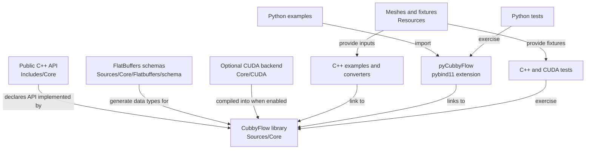

Most changes start in the core library. Examples, bindings, and tests consume
that behavior and should not reimplement it.

## Five-Minute Mental Model

CubbyFlow separates **when a simulation advances**, **where its state lives**,
and **how one numerical operation is performed**:

1. `PhysicsAnimation` turns requested frames into one or more time substeps.
2. A concrete fluid solver owns the order of operations for each substep.
3. `GridSystemData`, `ParticleSystemData`, or both own the changing state.
4. Emitters add state; colliders describe moving solid boundaries.
5. Strategy objects perform one grid operation such as advection, diffusion,
   pressure projection, or level-set evolution.

This separation is the central design rule. A smoke solver changes the
substep's behavior and adds smoke fields; an alternative pressure algorithm
replaces the pressure strategy without creating another smoke solver.

### Vocabulary

| Term                | Plain-language meaning                                                   |
| ------------------- | ------------------------------------------------------------------------ |
| Frame               | The caller's requested output point in time.                             |
| Substep             | A smaller stable interval used to advance one frame.                     |
| Field               | A scalar or vector value that can be sampled at any position.            |
| Grid                | A field stored at regular spatial sample locations.                      |
| Particle data       | Parallel arrays of positions, velocities, forces, and custom attributes. |
| SDF                 | A signed-distance field; negative values are inside a region.            |
| Emitter             | A time-dependent source of particles or grid values.                     |
| Collider            | A moving surface plus collision and boundary behavior.                   |
| Advection           | Transporting a quantity through the velocity field.                      |
| Pressure projection | Correcting velocity to satisfy incompressibility and boundaries.         |
| CFL                 | A speed-to-grid-size measure used to choose stable substeps.             |
| PIC / FLIP / APIC   | Particle-in-Cell, Fluid-Implicit-Particle, and Affine Particle-in-Cell.   |
| SPH / PCISPH        | Smoothed Particle Hydrodynamics and Predictive-Corrective Incompressible SPH. |
| Strategy            | A replaceable object that owns one numerical operation.                  |

### Choosing A Solver Family

Use this as an architecture map, not as a claim that one method is universally
better:

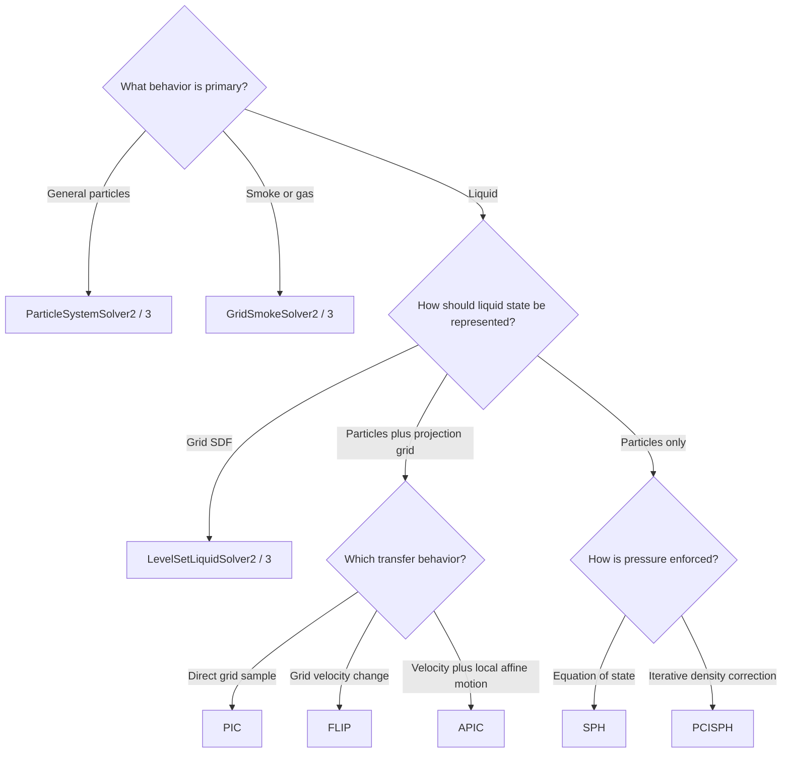

Once the family is chosen, the later sections explain its state, substep flow,
and replaceable numerical policies.

## Module Map

The core library is grouped by responsibility:

- `Animation/` owns frames and fixed/adaptive time progression.
- `Array/`, `Math/`, and `Matrix/` provide containers, vectors, matrices, and
  numerical primitives.
- `Geometry/` and `Field/` describe surfaces, colliders, transforms, and sampled
  fields.
- `Grid/` and `Particle/` own grid-based (Eulerian) and particle-based
  (Lagrangian) simulation data.
- `Emitter/`, `Searcher/`, `QueryEngine/`, and `PointGenerator/` create and
  query simulation state.
- `FDM/` contains finite-difference systems, BLAS helpers, and multigrid data.
- `Solver/Advection/` contains semi-Lagrangian advection strategies.
- `Solver/FDM/` contains iterative linear-system solvers.
- `Solver/Grid/` contains grid fluid, smoke, pressure, diffusion, and boundary
  solvers.
- `Solver/LevelSet/` contains level-set evolution and liquid solvers.
- `Solver/Hybrid/` contains PIC, FLIP, and APIC particle-grid solvers.
- `Solver/Particle/` contains basic particle, SPH, and PCISPH solvers.
- `PointsToImplicit/` converts particle samples into implicit surfaces.
- `Utils/` contains serialization, logging, timing, and parallel execution
  helpers.
- `CUDA/` contains optional CUDA data structures and particle solvers.

Public and implementation trees use the same domain names. Add behavior to the
existing domain rather than introducing a second organizational layer.

### Shortest Code Reading Path

For one concrete route through the architecture, follow the 3-D smoke example:

1. [`SmokeSim/main.cpp`](Examples/SmokeSim/main.cpp#L214) creates a solver and
   emitter, then advances frames.
2. [`PhysicsAnimation.cpp`](Sources/Core/Animation/PhysicsAnimation.cpp) turns
   each requested frame into time substeps.
3. [`GridFluidSolver3.cpp`](Sources/Core/Solver/Grid/GridFluidSolver3.cpp) owns
   the common grid-solver pipeline.
4. [`GridSmokeSolver3.cpp`](Sources/Core/Solver/Grid/GridSmokeSolver3.cpp) adds
   smoke fields, buoyancy, diffusion, and decay.

The corresponding 2-D classes preserve the same outer structure.

## Time-Stepping Model

`PhysicsAnimation` is the common time driver for physical solvers. A caller
updates an animation with a `Frame`; the animation initializes once, advances
any missing frames, divides each frame into fixed or adaptive substeps, and
calls the concrete solver's `OnAdvanceTimeStep()` for every substep.

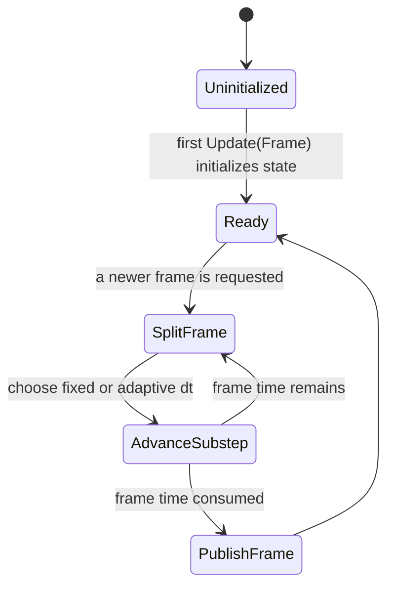

Adaptive solvers override `GetNumberOfSubTimeSteps()`. Grid fluid solvers use
their CFL condition to keep a substep below the configured maximum CFL.

### Grid Solver Step

`GridFluidSolver2` and `GridFluidSolver3` own a `GridSystemData` instance and
compose advection, diffusion, pressure, and boundary-condition solvers. Their
shared step order is:

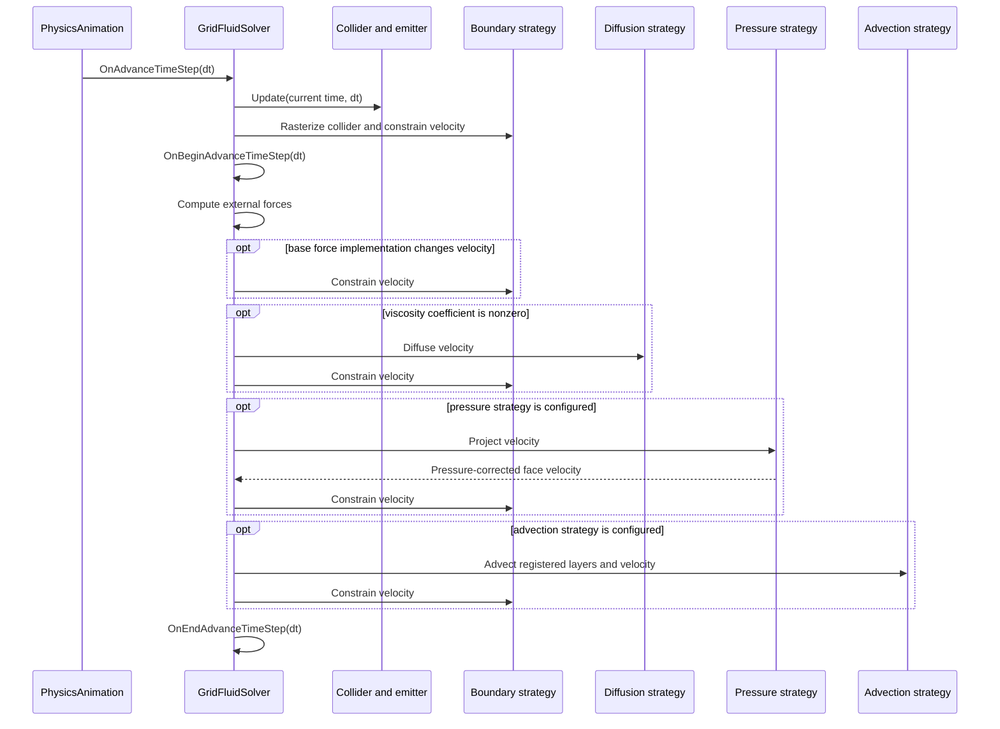

Base gravity, viscosity, pressure, and advection constrain velocity after
modifying it. A derived force or advection hook owns the same responsibility
when it bypasses the base implementation. Derived solvers specialize the
begin, force, advection, or end hooks while preserving this outer pipeline.
Their complete data flows are described below.

### Particle Solver Step

`ParticleSystemSolver2` and `ParticleSystemSolver3` own particle data, an
emitter, and an optional collider. Their step order is:

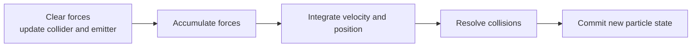

SPH and PCISPH retain this outer pipeline and replace the force accumulation and
step hooks.

## Core Data Model

The solver layer coordinates a small set of reusable state and environment
objects:

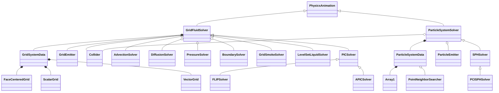

Inheritance arrows point to the base class. Filled diamonds mark primary
simulation state; hollow diamonds mark replaceable or shared collaborators.
The diagram omits `<N>` and the `2`/`3` suffixes for readability. Each displayed
node corresponds to a searchable core type: template-backed data types use the
unsuffixed template name, while solver boxes stand for their 2-D and 3-D pair.

- `GridSystemData<N>` owns grid resolution, spacing, origin, a face-centered
  velocity grid, and registered scalar/vector data layers. Advectable layers
  participate automatically in the base grid solver's advection pass.
- `ParticleSystemData<N>` owns radius, mass, particle attribute arrays, a point
  neighbor searcher, and neighbor lists. Adding or resizing particles
  invalidates neighbor data until it is rebuilt.
- `SPHSystemData<N>` extends particle data with density, pressure, kernel
  radius, and SPH-specific neighbor updates.
- Fields provide sampled scalar or vector functions. Surfaces provide explicit
  geometry; implicit surfaces provide signed-distance queries used by fluid and
  collision code.
- Colliders pair surfaces with motion and collision response. Emitters write
  particles or grid values before a solver advances its state.

Solvers own orchestration; data containers own simulation state; numerical
strategy objects own one operation. Keep new behavior at the lowest layer that
already owns the relevant invariant.

## Spatial And Numerical Contracts

### Grid Layout And Sampling

`Grid<N>` stores the common domain metadata: resolution, spacing, origin, and
bounding box. Data grids add arrays at locations derived from that domain.

| Grid type                        | Sample location                            | Main use                                                 |
| -------------------------------- | ------------------------------------------ | -------------------------------------------------------- |
| Cell-centered scalar or vector   | One value at each cell center              | Density, temperature, signed distance, collocated fields |
| Vertex-centered scalar or vector | Values on the cell vertices                | Nodal fields and interpolation                           |
| Face-centered vector             | Each component on faces normal to its axis | Fluid velocity, divergence, and pressure projection      |

One 2-D cell contains all three layouts at different positions:

```text
                         v(i, j + 1)
                     +-------^-------+
                     |               |
          u(i, j) -->|    q(i, j)    |--> u(i + 1, j)
                     |               |
                     +-------^-------+
                          v(i, j)

    +              vertex-centered sample
    q(i, j)        cell-centered scalar or vector sample
    u(...) / v(...) face-centered x/y velocity samples
```

A face-centered grid stores one scalar array per axis. For example, the
x-component lies on x-normal faces and has one more sample along x than the
cell resolution. `ValueAtCellCenter()` averages adjacent face values;
`DivergenceAtCellCenter()` differences them. This staggered layout lets the
pressure step apply a gradient directly to the velocity samples that bound a
cell.

Scalar and vector grids also implement the `ScalarField<N>` and
`VectorField<N>` interfaces. Algorithms can therefore consume either stored
grids or procedural fields through `Sample(position)`. Grid sampling is linear
by default; an algorithm such as `CubicSemiLagrangian2/3` can select a higher
order source sampler without changing the stored grid type.

### Region And Boundary Representation

Level-set helpers use one sign convention everywhere:

- A signed-distance value below zero is inside the represented region.
- `boundarySDF < 0` means solid collider; positive values mean open space.
- `fluidSDF < 0` means fluid; positive values mean atmosphere.

The base grid solver returns a constant negative fluid SDF, so the whole domain
is fluid unless a derived solver supplies an interface. Level-set and PIC-type
solvers override `GetFluidSDF()` with their current signed-distance grid.

The boundary-condition solver rasterizes the collider surface and collider
velocity onto the current grid domain. It constrains face velocities against
that moving boundary and the solver's closed-domain flags. Advection,
diffusion, and pressure receive the same collider SDF, so solid classification
does not need to be rebuilt independently in each numerical stage.

### Managed Grid Layers

`GridSystemData<N>` separates ordinary and advectable scalar/vector layers.
That registration choice is behavioral:

- `AddAdvectableScalarData()` and `AddAdvectableVectorData()` opt a layer into
  the base grid solver's advection pass.
- `AddScalarData()` and `AddVectorData()` store derived or externally managed
  state that the base solver must not transport.
- The face-centered velocity is advectable vector layer zero, but the base
  solver handles it separately after custom vector layers.

Each advection pass clones the source grid before writing the destination. This
keeps sampling stable while the output is updated. Smoke density, temperature,
and the level-set liquid SDF are advectable. The PIC liquid SDF is not: it is
rebuilt from particle positions every step.

All registered layers share resolution, spacing, and origin. Resizing
`GridSystemData` resizes them together, which is the invariant numerical
strategies rely on when combining velocity, scalar fields, and region masks.

### Particle Arrays And Neighborhoods

`ParticleSystemData<N>` stores particle attributes as arrays rather than one
object per particle. Position, velocity, and force are distinguished vector
layers; solvers can add further scalar or vector layers and keep only their
indices. `SPHSystemData<N>` uses this mechanism for density and pressure.

Adding particles or changing their count invalidates the neighbor searcher and
neighbor lists. Code that reads neighborhoods must rebuild them after emission
or resizing. SPH uses its kernel radius as the search radius, then derives
density, gradients, and Laplacians from that same neighborhood. Changing target
spacing or relative kernel radius also changes the mass/kernel contract and
requires the neighborhood and densities to be refreshed.

### Pressure Projection And FDM

The pressure stage converts velocity and region fields into a finite-difference
linear system, solves for pressure, and applies its gradient back to the
face-centered velocity:

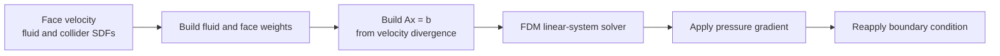

`FDMLinearSystem2/3` stores a regular-grid stencil, vector `x`, and right-hand
side `b`. The compressed form stores only participating rows in a CSR matrix;
the multigrid form stores systems at multiple resolutions. The fractional
single-phase pressure solver builds cut-cell weights from collider and fluid
SDFs, supports regular or compressed systems, and recognizes an
`FDMMGSolver2/3` when multigrid is injected.

Pressure projection is the boundary between fluid orchestration and generic
linear algebra. A new pressure discretization belongs in `Solver/Grid/`; a new
way to solve the resulting `Ax = b` belongs in `Solver/FDM/`.

## Solver Family Data Flows

### Smoke

Smoke is a single-phase grid solve over the whole non-solid domain. Density and
temperature are cell-centered advectable layers; they influence velocity but
do not define the fluid region.

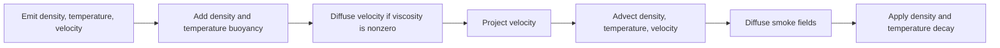

Buoyancy is the smoke solver's external-force hook. It samples density and
temperature at velocity-face positions and uses the opposite of gravity as
"up" when gravity is nonzero. Smoke-specific diffusion and decay run in the
end-step hook after the base advection pass.

### Level-Set Liquid

The level-set solver stores the liquid interface in an advectable
cell-centered SDF. A newly constructed field is positive everywhere, so an
emitter or caller must create a negative liquid region.

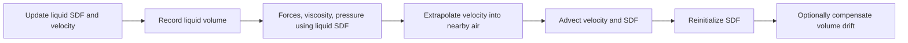

The default `ENOLevelSetSolver2/3` reinitializes the transported field so its
magnitude remains distance-like. Velocity extrapolation uses the fast marching
solver over a band sized from CFL and the minimum reinitialization distance.
Optional global compensation shifts the SDF after reinitialization to recover
the measured volume difference.

### PIC, FLIP, And APIC

Hybrid solvers use particles as the persistent liquid samples and the grid as a
temporary workspace for forces and incompressibility:

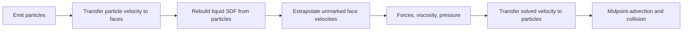

The P2G pass accumulates weighted velocity and a weight per face, normalizes
marked faces, then extrapolates into nearby unmarked faces. The liquid SDF is
rebuilt with a particle neighbor search and feeds the grid pressure solve. It
is deliberately non-advectable because particle positions are its source of
truth.

- PIC replaces each particle velocity with the sampled post-solve grid
  velocity.
- FLIP adds the sampled grid-velocity change to the previous particle velocity;
  its blending factor can mix that result with PIC to reduce noise.
- APIC carries local affine velocity coefficients and includes them in both
  transfers to retain more sub-grid motion.

All three move particles through the solved velocity field with midpoint
integration, clamp closed domain faces, and finally resolve collider contact.

#### Reading One PIC Substep In Code

The 2-D call trace below has a structurally matching 3-D counterpart:

| Order | Owner and method                            | State transition                                                                                        |
| ----- | ------------------------------------------- | ------------------------------------------------------------------------------------------------------- |
| 1     | `GridFluidSolver2::BeginAdvanceTimeStep()`  | Update collider and grid emitter, rebuild collider fields, constrain velocity.                          |
| 2     | `PICSolver2::OnBeginAdvanceTimeStep()`      | Emit particles, transfer particle velocity to the grid, rebuild liquid SDF, fill nearby unmarked faces. |
| 3     | `GridFluidSolver2::ComputeExternalForces()` | Add gravity or a derived solver's external force to face velocity.                                      |
| 4     | `GridFluidSolver2::ComputeViscosity()`      | Diffuse a cloned velocity grid when viscosity is nonzero.                                               |
| 5     | `GridFluidSolver2::ComputePressure()`       | Build and solve the pressure system, then constrain corrected velocity.                                 |
| 6     | `PICSolver2::ComputeAdvection()`            | Fill face velocity, transfer it back to particles, move particles, resolve domain and collider contact. |

The trace shows why PIC derives from the grid solver: it reuses the middle
force/viscosity/pressure pipeline and replaces only the state-transfer work
before and after it.

### SPH And PCISPH

SPH extends the basic particle step rather than using the grid pipeline:

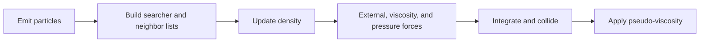

The adaptive substep limit considers both the speed of sound and the largest
force relative to particle mass and kernel radius. Standard SPH computes
pressure from the current density with an equation of state, then accumulates
symmetric pressure-gradient and viscosity forces over neighbor lists.

PCISPH replaces only the pressure-force stage. It repeatedly predicts particle
velocity and position, resolves predicted collisions, estimates density error,
updates pressure, and rebuilds pressure forces until the density-error ratio is
small enough or the configured iteration limit is reached. The accepted force
then returns to the ordinary particle integration path.

## Strategy Composition

`GridFluidSolver2/3` selects numerical policy through existing strategy
interfaces. Its constructors install these defaults:

| Concern               | Interface                        | Default implementation                                  | Contract                                                                  |
| --------------------- | -------------------------------- | ------------------------------------------------------- | ------------------------------------------------------------------------- |
| Advection             | `AdvectionSolver2/3`             | `CubicSemiLagrangian2/3`                                | Transport advectable fields and velocity outside solids                   |
| Diffusion             | `GridDiffusionSolver2/3`         | `GridBackwardEulerDiffusionSolver2/3`                   | Diffuse scalar or vector fields inside the requested region               |
| Pressure              | `GridPressureSolver2/3`          | `GridFractionalSinglePhasePressureSolver2/3`            | Project face velocity using fluid, collider, and collider-velocity fields |
| Boundary              | `GridBoundaryConditionSolver2/3` | Suggested by the pressure solver; fractional by default | Constrain velocity at colliders and closed domain faces                   |
| Pressure linear solve | `FDMLinearSystemSolver2/3`       | `FDMICCGSolver2/3`                                      | Solve the pressure solver's regular or compressed system                  |
| Level-set evolution   | `LevelSetSolver2/3`              | `ENOLevelSetSolver2/3` in liquid solvers                | Reinitialize or extrapolate signed-distance data                          |

Setters replace advection, diffusion, and pressure strategies without changing
the outer time-step order. A null operation strategy skips its stage. Setting a
non-null pressure solver also replaces the boundary-condition solver with the
pressure solver's suggested implementation and reapplies the closed-domain
flags. Linear-system policy is replaced on the pressure or diffusion strategy,
not on `GridFluidSolver` itself.

Use strategy injection when only a numerical method changes. Derive from the
fluid solver when the change adds state or changes the orchestration hooks, as
smoke, level-set liquid, and PIC do. Builders configure resolution, spacing,
and origin; strategy replacement happens on the constructed solver.

## 2-D And 3-D Structure

Foundational types commonly use `template <size_t N>` and expose readable
aliases such as `Foo2` and `Foo3`. Algorithms with a single dimension-independent
implementation are instantiated for both supported dimensions.

Many high-level solvers use paired classes instead, such as `GridFluidSolver2`
and `GridFluidSolver3`. These files intentionally mirror one another because
their indexing and component operations differ. A change to shared behavior
must inspect both siblings, their builders, aliases, bindings, and tests.

Some geometry is inherently 3-D. A 2-D counterpart should exist only when the
domain itself supports it.

## Python Boundary

`pyCubbyFlow` is a pybind11 module linked to `CubbyFlow`.

- `Includes/API/Python/` declares `Add*` registration functions by domain.
- `Sources/API/Python/` implements the bindings in a tree that mirrors the
  public core API.
- `Sources/API/Python/main.cpp` registers types in dependency order, normally
  adding both the 2-D and 3-D forms together.

The Python layer translates naming where needed but does not own alternate
simulation behavior. Public C++ types, methods, defaults, or enums that are
Python-visible must remain aligned with the binding and `Tests/PythonTests/`.
The root build enables the Python target only for CPU-only, non-SonarCloud
configurations.

## CUDA Boundary

When `USE_CUDA=ON` and a CUDA toolkit is available, CMake adds `.cu` sources
under `Sources/Core/CUDA/` to the `CubbyFlow` library and defines
`CUBBYFLOW_USE_CUDA`. CUDA device sources use C++17 for the supported CUDA
toolchains; CPU-only builds omit those files.

CUDA types and solvers live under `Includes/Core/CUDA/` and
`Sources/Core/CUDA/`; CUDA tests live under `Tests/CUDATests/`. Matching CPU and
CUDA implementations should agree where they model the same operation, but
ordinary core code must not require CUDA.

## Serialization

Serializable grid, particle, SPH, and point-search data use FlatBuffers.
Schemas under `Sources/Core/Flatbuffers/schema/` are the source of truth;
checked-in headers under `Sources/Core/Flatbuffers/generated/` are derived from
them. Shared models have separate 2-D and 3-D schemas, which must evolve
together when their stored contract is shared.

## Parallel Execution

Core algorithms call the helpers in `Includes/Core/Utils/Parallel.hpp` rather
than a tasking backend directly. CMake selects TBB, OpenMP, HPX, the C++11
thread implementation, or the serial backend. Solver behavior must remain the
same regardless of that choice.

## Build Targets

CMake defines these main targets:

- `CubbyFlow`: the core static library from `Sources/Core/`.
- `pyCubbyFlow`: the optional Python extension from `Sources/API/Python/`.
- `UnitTests`: GoogleTest coverage for core C++ behavior.
- `CUDATests`: doctest coverage for CUDA behavior when CUDA is enabled.
- `ManualTests`, `MemPerfTests`, and `TimePerfTests`: scenario, memory, and
  benchmark executables.
- The directories under `Examples/`: standalone consumers linked to the core
  library.

Source lists use CMake globbing. Reconfigure CMake after adding files so the
affected target sees them.

## Change Boundaries

| Change                                       | Start here                                       | Also inspect                                      |
| -------------------------------------------- | ------------------------------------------------ | ------------------------------------------------- |
| Math, container, grid, or particle invariant | Shared `Includes/Core/` type and matching source | Both dimensions and every caller                  |
| Grid time-step behavior                      | `GridFluidSolver2/3` or the owning strategy      | Derived grid, level-set, and hybrid solvers       |
| Particle time-step behavior                  | `ParticleSystemSolver2/3` or `SPHSystemData`     | SPH, PCISPH, emitters, and colliders              |
| Public API                                   | Core declaration and implementation              | Builders, Python bindings, examples, and tests    |
| Serialized state                             | Matching `.fbs` schemas                          | Generated headers and round-trip tests            |
| CUDA operation                               | CPU and CUDA counterparts                        | CPU-only build and `CUDATests`                    |
| Build shape                                  | Root and nearest `CMakeLists.txt`                | Affected CI workflows and optional configurations |

Use the narrowest test that covers the changed behavior. See
[`AGENTS.md`](AGENTS.md) for the repository's detailed development and
validation rules.
